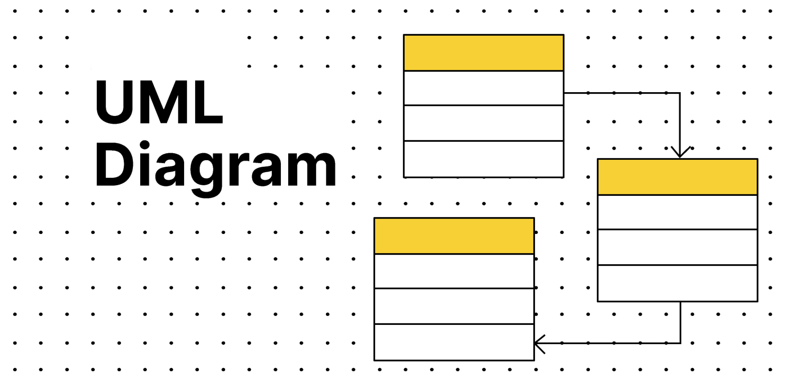

# UML 前言

## 编写目的

Hello，我是[老腰](https://ruizhengyun.cn/manage-grow/about)，一名前端工程师，本文档主要记录自己的习行并帮助同行。

## 编写背景

编写这个小册缘起于最近公司校企合作的课程设计中需要讲解 UML 建模的这块知识。由于工作实际操作中觉得这块有些耽误时间，设计环节就跳过直接投入开发实现了。其实，设计环节中这块内容还是很有必要去实施的。

接下来，我会根据一些资源并结合自己的一些主观能动性做些删改来记录重学 UML 知识。

## 概述说明

UML， 是一种**系统建模语言**，以**图形化的方式**对软件系统进行分析和设计。因**定义明确**、**易于表达**和**功能强大**而受到软件行业的普遍认可和领域内的广泛应用。

接下来通过下面大纲来了解 UML。

- [实践](/practice.md)

## 反馈与共建

请访问 [GitHub](https://github.com/run-kit/uml.git) 或加我个人微信 **run-kit** ，我们微信群内交流并讨论。
