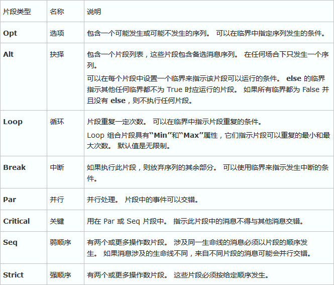
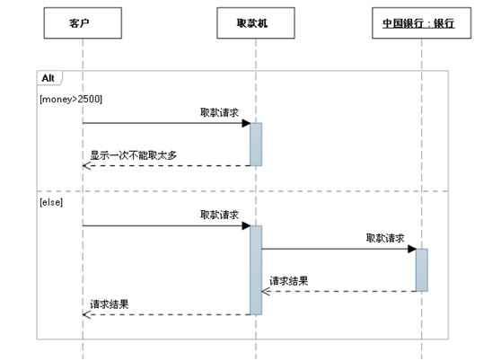
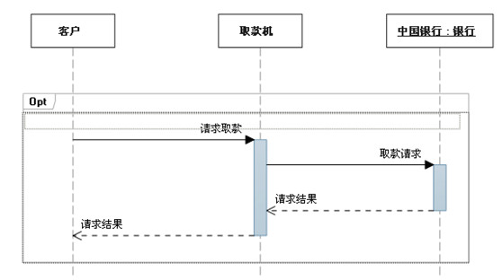
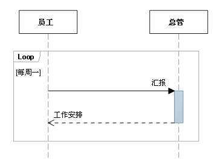
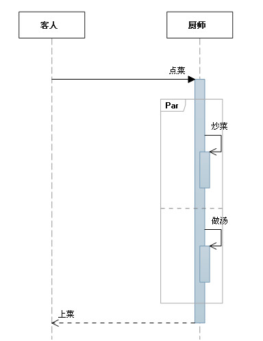

# 时序图

时序图（Sequence Diagram），亦称为序列图、循序图或顺序图，是一种 UML 交互图，通过**描述对象**之间发送消息的**时间顺序**显示多个对象之间的**动态协作**。

它是一个**二维图**，横轴表示**对象**，纵轴表示**时间**，消息在各对象之间横向传递，依照时间顺序纵向排列。

## 作用

- 展示对象之间交互的顺序。将交互行为建模为消息传递，通过描述消息是如何在对象间发送和接收的来动态展示对象之间的交互；
- 相对于其他 UML 图，时序图更强调交互的时间顺序；
- 可以直观的描述并发进程；

## 组成元素

### 角色（Actor）

系统角色，可以是人、机器、其他系统、子系统。

### 对象（Object）

#### 对象的三种命名方式

- 第一种方式包括`对象名`和`类名`，例如：`直播课时:课时`，在时序图中，用`对象:类`表示；
- 第二种方式只显示`类名`，即表示它是一个`匿名对象`，例如：`:课程`；在时序图中，用`:类`表示；
- 第三种方式只显示`对象名`不显示`类名`，例如：`讲师`；在时序图中，用`对象`表示。

#### 命名方式的选择

三种命名方式均可，哪种最容易让阅读该时序图的人理解，就选择哪种。

#### 对象的排列顺序

对象的左右顺序并不重要，但是为了作图清晰整洁，通常应遵循以下两个原则：

- 把交互频繁的对象尽可能的靠拢；
- 把初始化整个交互活动的对象放置在最左端；

### 生命线（Lifeline）

在时序图中表示为从对象图标向下延伸的一条虚线，表示对象存在的时间。

### 控制焦点（Focus of Control）

又称为激活期，表示时间段的符号，在这个时间段内对象将执行相应的操作。它可以被理解成 C 语言语义中一对花括号 `{ }` 中的内容，用小矩形表示。

### 消息（Message）

消息一般分为`同步消息（Synchronous Message）` 、`异步消息（Asynchronous Message）`和`返回消息（Return Message）`。

- 消息的发送者把控制传递给消息的接收者，然后停止活动，等待消息的接收者放弃或者返回控制。用来表示`同步`的意义；
- 消息发送者通过消息把信号传递给消息的接收者，然后继续自己的活动，不等待接受者返回消息或者控制。`异步消息`的接收者和发送者是`并发`工作的。
- `返回消息`表示从过程调用返回。

### 自关联消息

表示方法的自身调用或者一个对象内的一个方法调用另外一个方法。

### 组合片段

组合片段用来解决交互执行的条件和方式，它允许在序列图中直接表示逻辑组件，用于通过指定条件或子进程的应用区域，为任何生命线的任何部分定义特殊条件和子进程。组合片段共有 13 种，名称及含义如下：

常用组合片段举例：

用来指明在两个或更多的消息序列之间的互斥的选择，相当于经典的if..else..

#### 抉择（Alt）

抉择在任何场合下只发生一个序列。 可以在每个片段中设置一个临界来指示该片段可以运行的条件。else 的临界指示其他任何临界都不为 True 时应运行的片段。如果所有临界都为 False 并且没有 else，则不执行任何片段。

#### 选项（Opt）

包含一个可能发生或不发生的序列。

#### 循环（Loop）

片段重复一定次数，可以在临界中指示片段重复的条件。

#### 并行（Par）

## 总结

时序图的绘制技巧：

- 从初始消息开始画，依次画出随后消息，并给每个消息分配序号，方便理解。
- 角色和对象用名词，消息用动词。
- 角色放在时序图的开始位置，对象重要程度或使用频率从左到右排列。这就要根据时间的流程考虑了，是一个比较主观的事情。
- 控制焦点两端要以消息元素封顶，控制焦点不要超过消息元素。
