# 用例图

项目初期阶段，不必过多地考虑系统实现的细节，主要工作是先明确系统的边界，即对用户需求进行分析，分析出系统的参与者及这些参与者会使用哪些功能。明确了系统范围，就能更好地估算项目的成本和进度，做出合理的计划和安排，为之后的各个阶段打下良好基础。UML 中使用「用例图」来对需求的分析结果建模。

用例图作用：

- 用例图常用于需求分析阶段；
- 描述如何使用系统，及描述待开发系统的功能需求；
- 用例图是软件需求到最终实现的第一步，是后续开发工作的基础；
- 用例图用于验证和检测所开发系统是否满足系统需求，从而影响到开发各个阶段和 UML 的各个模型；

用例图是由**参与者 Actor**、**用例 Use Case**及它们之间的关系构成的用于描述系统功能的**静态视图**。用例图是被称为参与者的外部用户所能观察到的系统功能的模型图，呈现了一些参与者和一些用例，以及它们之间的关系，主要用于对系统、子系统或类的功能行为进行建模。

## 参与者

参与者 Actor，是指存在于系统外部并直接与系统进行交互的人、系统、子系统或类的外部实体的抽象。

在用例图中，使用一个人形图标来表示，参与者名字写在图标下面。

### 参与者分类

- 是真实的人，即用户，是最常见的参与者；
- 是其他的系统及硬件设备；
- 是一些可以运行的进程；

### 参与者间的关系

参与者实质上是类，它拥有与类相同的关系描述，及参与者之间是泛化关系，或继承关系。

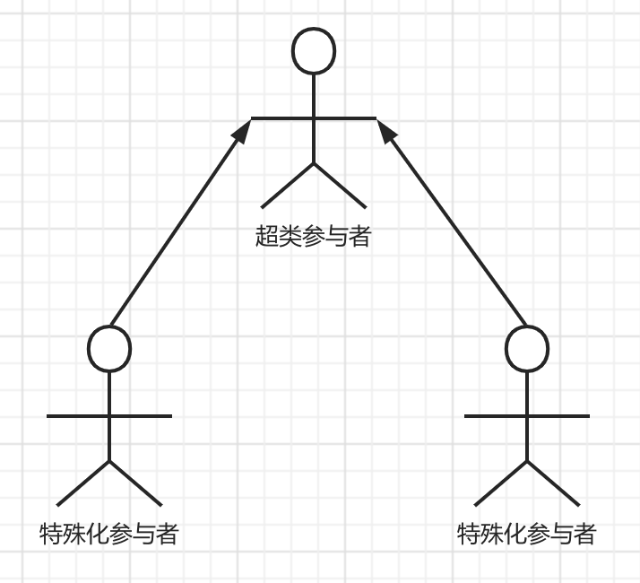

## 用例

用例 Use Case，是外部可见的系统功能单元，即一个用例就指系统的一种功能。用例的用途是在不

在 UML 中，用例椭圆表示，用例名字写在椭圆下方。

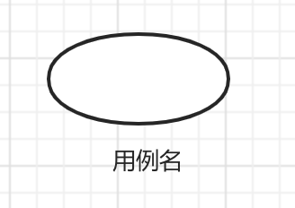

### 用例命名

必须是唯一的名字，区别其他用例。用例名字是一个字符串，包括单名和路径名。

### 用例之间关系

参与者与用例之间的联系用实现的箭线连接。

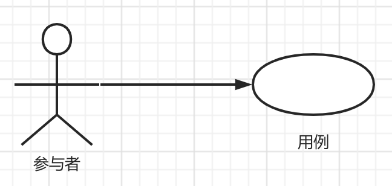

用例除了与参与者发生关联外，还可以具有系统中的多种关系。包括：

- 包含关系，包含其他用例具体行为，并把它所包含的用例行为作为自身行为的一部分。有两种情况用到包含关系；
  - 多个用例用到同一段行为，可把共同行为单独抽象成为一个用例，其他用例包含这一用例。如借书还书都需要验证是否超期。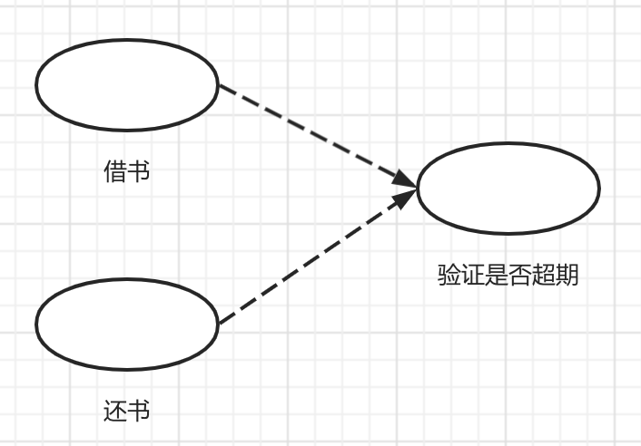
  - 用例的功能过多、事件流过于发杂，可把某一段事件流抽象成为一个被包含的用例。如管理增删改用户。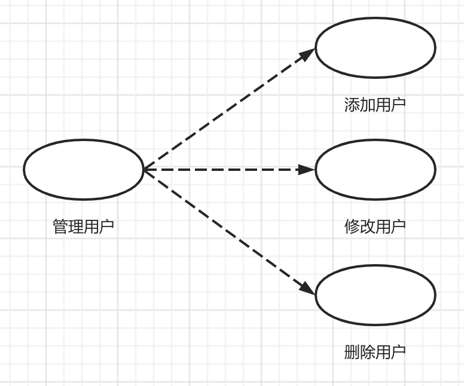
- 扩展关系，Extension，把新的行为加到已有的用例中，获得新用例，原有用例叫做基础用例。比如身份验证时修改密码。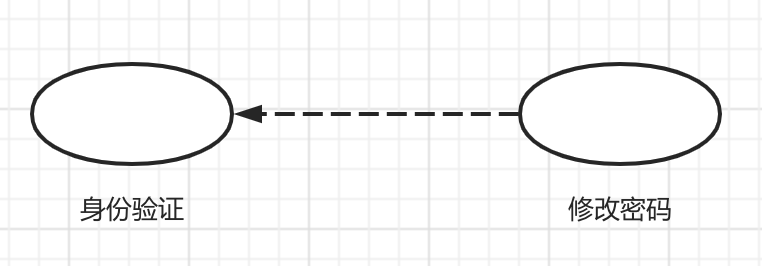
- 泛化关系，一个父用例可以被特化形成多个子用例，子用例继承了父用例所有的的结构、行为和关系。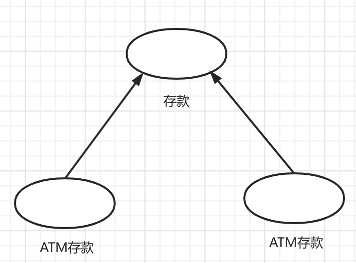

应用这些关系的目的是从系统中抽取公共行为和其变体。

### 用例描述

用例图能让项目关系人在短时间内了解项目参与者及参与者相关的系统功能。

功能细节不宜在用例图中过多描述，可采用「用例图」集合「用例描述」的方式对系统需求分析的结果进行建模。

用例描述主要描述用例的作用，简单扼要，但应包括执行用例的不同类型用户和通过这个用例要达到的结果。

| 名称 | 说明 |
| :- | :- |
| 功能编号 | 唯一标识用例的编号 |
| 用例名称 | 说明用例功能的名称 |
| 用例描述 | 对用例功能进行简明扼要的描述 |
| 优先级   | 一般、中等、优先等描述。根据共重要性和紧急程度来划分优先级 |
| 参与者   | 用例图中与该用例相关联的参与者 |
| 前置条件 | 在该用例系统功能开始操作之前，要做好哪些工作 |
| 后置条件 | 该用例的系统功能执行完毕，系统产生了哪些变化 |
| 事件流   | 事件流是从用户角度描述执行用例的具体步骤，关注系统“做什么”，而不是“怎么做” |
| 活动图   | 描述复杂的程序流程 |

## 实战示例

1. 确定参与者

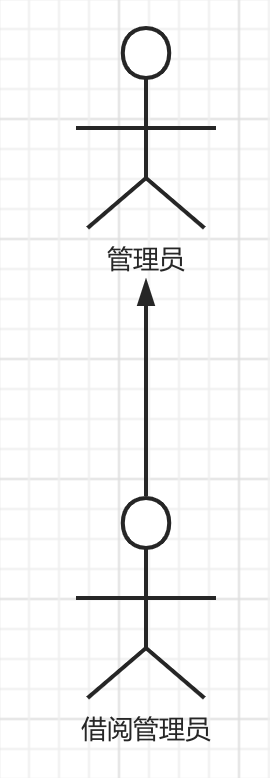

2. 确定用例

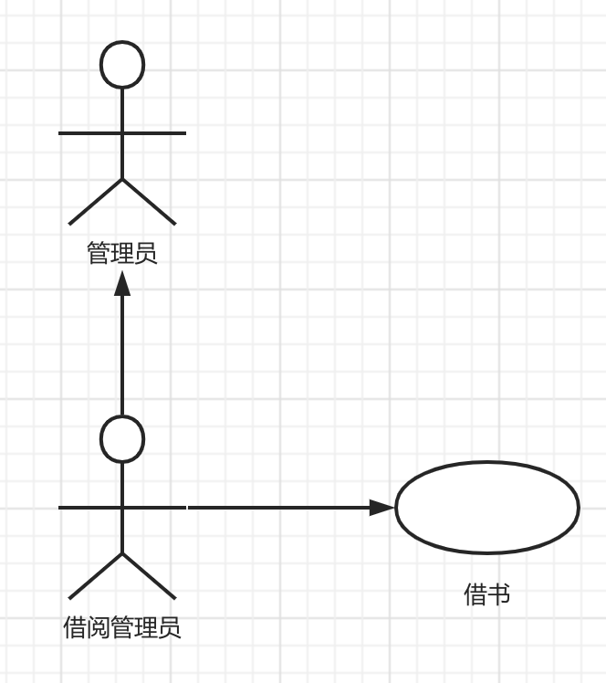

3. 用例之间的关系

   - 包含关系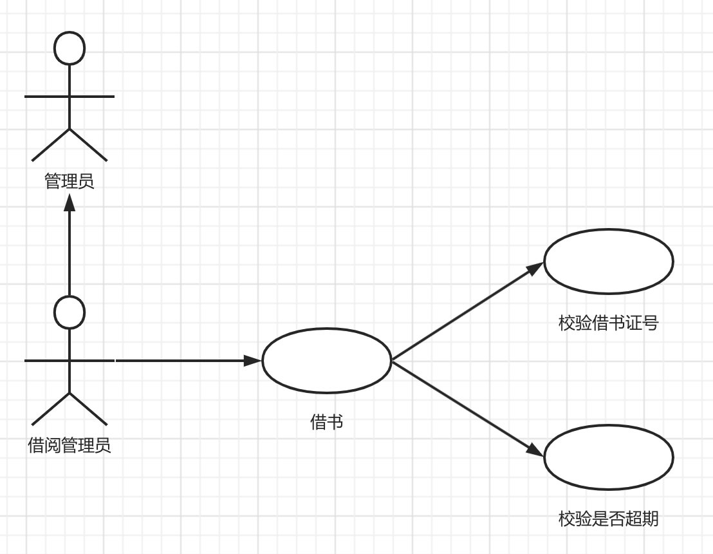
   - 扩展关系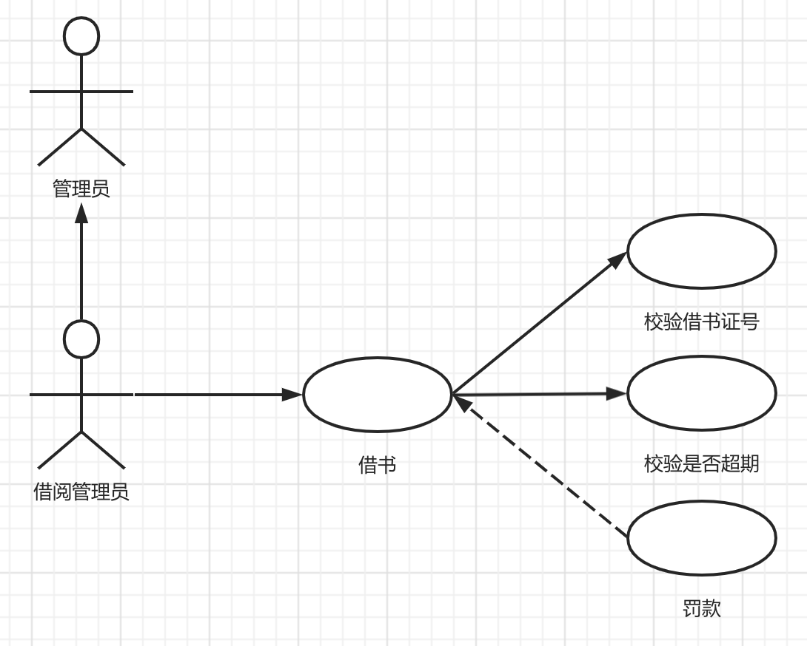
   - 泛化关系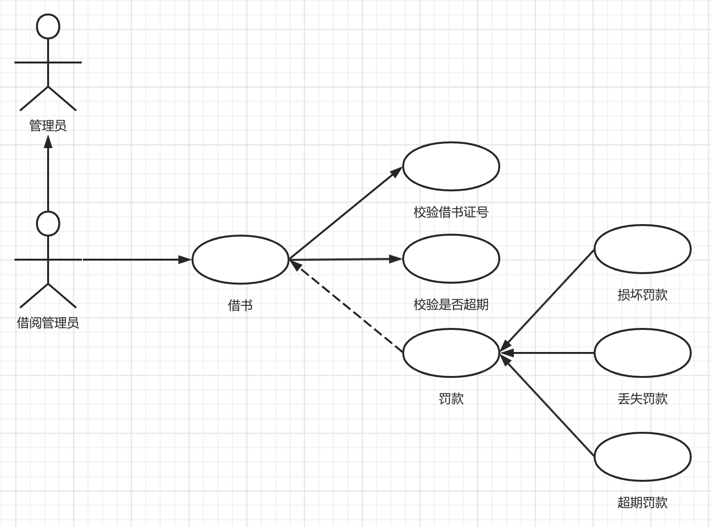

4. 用例描述

图书借阅系统借书用例详细说明表

| 名称 | 说明 |
| :- | :- |
| 功能编号 | BookBorrow001 |
| 用例名称 | 借书 |
| 用例描述 | 借出图书时，借阅者将图书和借阅者交个图书借阅员，办理借阅手续。图书借阅员输入借阅者的借阅证号，系统验证借阅证是否有效，验证是否有超期图书。通过验证后，完成借阅操作。借书时，如有图书损坏、丢失和超期情况，将急性相应的罚款。|
| 优先级   | 一般 |
| 参与者   | 图书借阅员 |
| 前置条件 | （1）图书借阅员成功登录到系统； （2）借阅者信息存在； （3）图书在库； |
| 后置条件 | 该用例的系统功能执行完毕，系统产生了哪些变化 |
| 事件流   | 事件流是从用户角度描述执行用例的具体步骤，关注系统“做什么”，而不是“怎么做” |
| 活动图   | 描述复杂的程序流程 |
